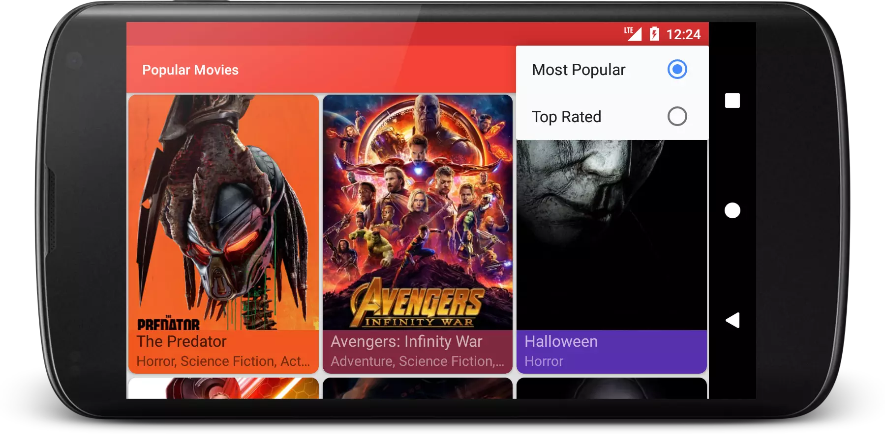
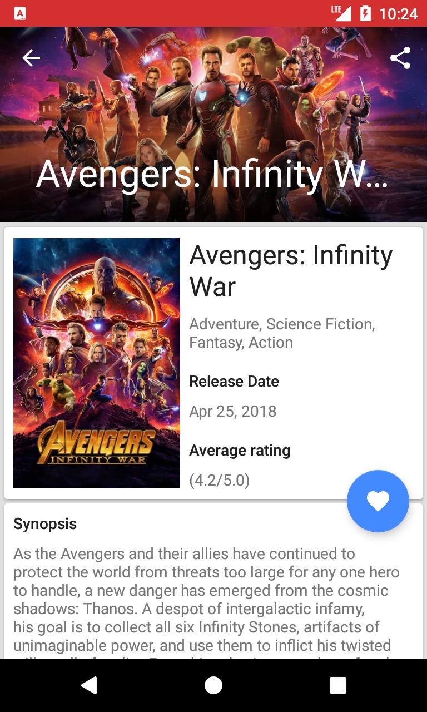

# Popular Movies
 
This is second project in the Android Developer Nanodegree, Udacity. I created it from scratch.

## Screenshots

## Features
- Sort movies based on popularity or top rated
- User can add movies to his favorites list and can remove them from the list
- Favorite movies are shown without internet connection
- Application shows the trailers and reviews of the movie, select the particular video thumbnail will show the video using Youtube app or any browser
- Application has an option to share the first trailer link using social media
## What does it do?
- Movies are displayed in the main layout via a grid of their corresponding movie poster thumbnails
- UI contains an element (i.e a spinner or settings menu) to toggle the sort order of the movies by: most popular, highest rated
- Movie details layout contains title, release date, movie poster, vote average, and plot synopsis
- When a user changes the sort criteria (“most popular, highest rated or favorites”) the main view gets updated correctly
- Movie Details layout contains a section for displaying trailer videos and user reviews
- In the movies detail screen, a user can tap a button to mark it as a Favorite. Tap the button on a favorite movie will remove it from favorites
- Used room library, ViewModel and LiveData etc

## Libraries and APIs used
- [Picasso](http://square.github.io/picasso/)
- [The Movie DB API](https://www.themoviedb.org/documentation/api)
- [Retrofit](http://square.github.io/retrofit/)
- [Room Library](https://developer.android.com/topic/libraries/architecture/room)
- [Architecture Components](https://developer.android.com/topic/libraries/architecture/)

## Before you build
  This project uses `TheMovieDB API` to fetch the movie name and details. Before you build the project add your `API KEY` to the `gradle.properties` file
